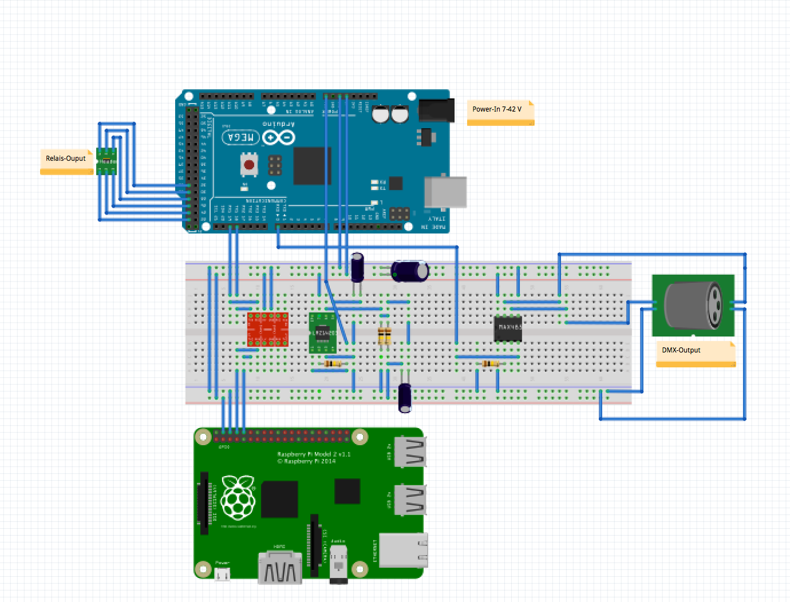

# SmartLightHub
## The easy way to control yout Lights
 Control all yout DMX Lights over a Webinterface with Scenes, Tasks and many more options.
 Create groups, combine channels from much dmx devices into one virtual device. Create Scenes and manage them with schedule tasks. Easy to setup.
Based on the popular Raspberry Pi (B/B+/2) and the Arduino Microcontrollerplattform.
It based only on php/javascript and python so you can run it on many other devices, like BananaPi, BeagleBoard,... You can also connect the Phillips Hue, dimmers, SPS or other many devices with analog or digital inputs.

 
 Please look at the /Documentation/SmartLightHub.pdf for further imformation (functions, schematics, spcifications).

# FEATURES
* Control all your DMX Devices
* Scenes
* Toggle Scenes at Time
* Group devices into rooms
* Group dmx channels into devices
* Easy scene creation with capture function

# PARTS
* Raspberry PI B/B+/2/3
* SD Card
* Mirco USB Cable
* USB power supply
* Arduino Mega 2560
* RS485 Chip
* DMX-Jack

# SETUP SOFTWARE
### RPI-SETUP (WEBSERVER)
* install the newest version of debian on your pi
* install a webserver of your choise eg. apache
* install php >= 5.0
* install mysql-server and phpmyadmin
* create a new table via phpmyadmin
* download the SmartLightHub-website files (`/Source/webinterface/smarthome_v2_stable/)` to the `www`dir
* change the mysql- database settings at : `/Source/webinterface/smarthome_v2_stable/db_config.php`
* start your webserver and ip:80/setup and follow the setup steps
* setup your database with the SETUP_DATABASE_WITH_SAMPLE_DATA-Button on the setup page
* setup a minute cron to call the cron.php
* goto management->add_node and setup there your led_node

### RPI-SETUP (NODE)
* download the python scripts located at `/Source/raspberry_pi_scripts/`to your pi
* edit the config.ini to your right serial-port
* add the node.py to your `rc.local`
* start the node.py script with su permissions

### ARDUINO SETUP
* download the latest Arduino IDE
* download the sketch located at `/arduino_uart_to_dmx_controlller/ARDUINO_NODE_DMX_CONVERTER/`
* upload the sketch to your arduino
* connect the arduino with the usb to the RPI

# SETUP HARDWARE
### ARDUINO SETUP

### RPI SETUP

# USAGE

# IMAGES

