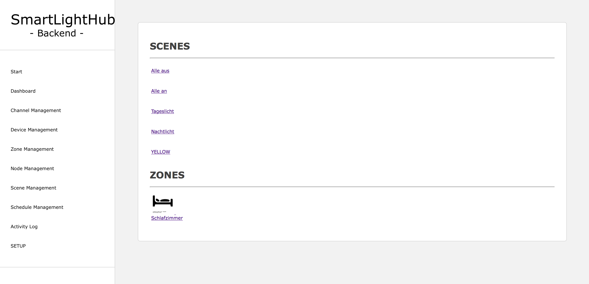
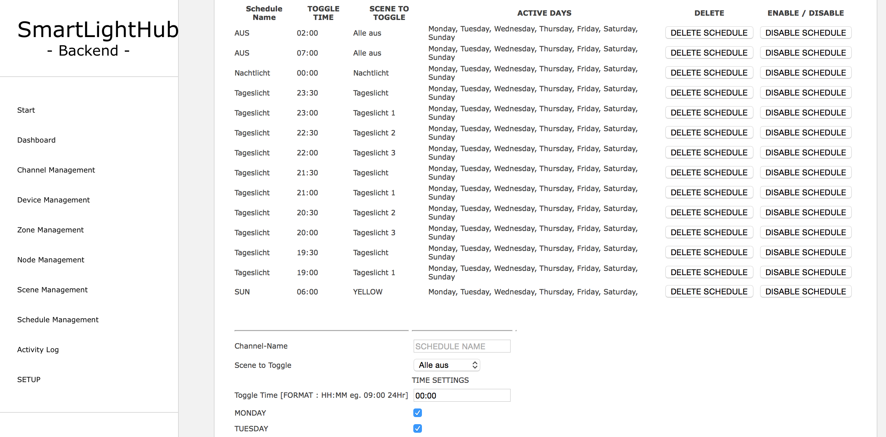

# SmartLightHub
## The easy way to control your DMX-Lights
Control all yout DMX Lights over a Webinterface with Scenes, Tasks and many more options.
Create groups, combine channels from much dmx devices into one virtual device. Create Scenes and manage them with schedule tasks. Easy to setup.
Based on the popular Raspberry Pi (B/B+/2) and the Arduino Microcontrollerplattform.
It based only on php/javascript and python so you can run it on many other devices, like BananaPi, BeagleBoard,... You can also connect the Phillips Hue, dimmers, SPS or other many devices with analog or digital inputs.

Please look at the /Documentation/SmartLightHub.pdf for further imformation (functions, schematics, spcifications).

# FEATURES
* Control all your DMX Devices
* Scenes
* Toggle Scenes at Time
* Group devices into rooms
* Group dmx channels into devices
* Easy scene creation with capture function
* Zones support
* Scheduling scenes

# PARTS
* Raspberry PI B/B+/2/3
* SD Card
* Mirco USB Cable
* USB power supply
* Arduino Mega 2560
* RS485 Breakout
* DMX-Jack

# SETUP SOFTWARE
### RPI-SETUP (WEBSERVER)
* install the newest version of debian on your pi
* install a webserver of your choise eg. apache
* install php >= 5.0
* install mysql-server and phpmyadmin
* create a new table via phpmyadmin
* download the SmartLightHub-website files (`/Source/webinterface/smarthome_v2_stable/)` to the `www`dir of your webserver
* change the mysql- database settings at : `/Source/webinterface/smarthome_v2_stable/db_config.php`
* setup a minute cron to call the `/Source/webinterface/smarthome_v2_stable/remote/cron.php`
* start your webserver and `http://ip:80/setup` and follow the setup steps
* setup your database with the SETUP_DATABASE_WITH_SAMPLE_DATA-Button on the setup page
* goto management->add_node and setup there your led_node

### RPI-SETUP (NODE)
* download the python scripts located at `/Source/raspberry_pi_scripts/`to your pi
* edit the `config.ini` to your right serial-port
* add the node.py to your `rc.local`
* start the `node.py` script with su permissions
* if you have not set a cronjob for the cron.php you can add the `cron.py` to your `rc.local` too
### ARDUINO SETUP
* download the latest Arduino IDE
* download the DMX libary : `https://github.com/mathertel/DMXSerial`
* download the sketch located at `/arduino_uart_to_dmx_controlller/ARDUINO_NODE_DMX_CONVERTER/`
* upload the sketch to your arduino
* connect the arduino with the usb to the RPI

# SETUP HARDWARE
### ARDUINO SETUP (simplyfied version)
* See the fritzing schematic : /Source/schematic/SmartLightHubNode_schematic.tiff
* Connect the programmed Arduino Mega2560 to the RPI via USB (or Serial RPI -> Serial1 of the Arduino, but you need an levelshifter)
* Connect the Serial2 of the Arduino to the RS485 Board
* Connect the output of the RS485 to the DMX jack

### RPI SETUP
NO FURTHER SETUP NEEDED

# USAGE
* login to the SmartLightHub WEbinterface on your PI
### ADD A DMX DEVIE
* goto management->channel management and add all your dmx channels of all your devices and give them a name
* goto management->devices and add a device, then add all channels you want to group into a device
* goto management->zones and add a zone, add all device you want to have in a zone/room

### SCENES
* goto management>scenes and add a light scene, name it
* goto dashboard and setup all your light settungs you want so store in a scene
* now back in the scene management click at the created scene on `CAPTURE` to save the current lightsettings in the scene
* now you can click on toggle scene to shw the scene up

### SCHEDULE
* goto management->schedule and add a new entry, the execution time, days, and whitch scene to toggle, name it
* in the schedule list you can activate/deactive them

# IMAGES WebUI
### DASHBAORD

### CHANNEL VALUES

### SCHEDULE LIST

